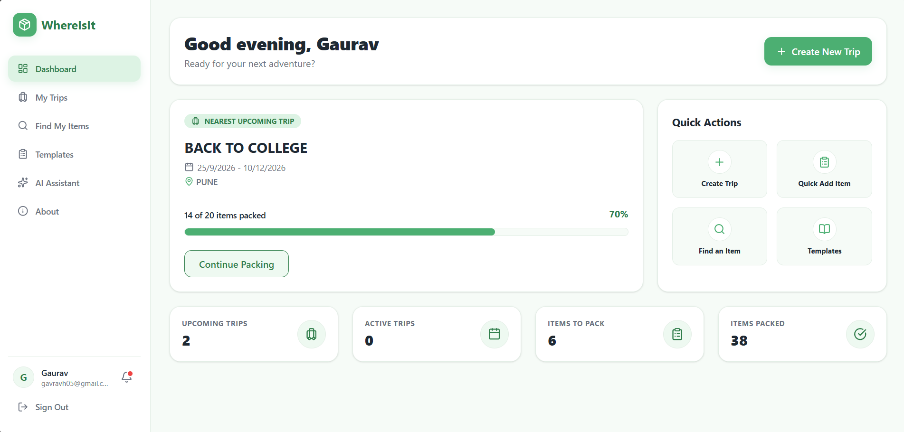
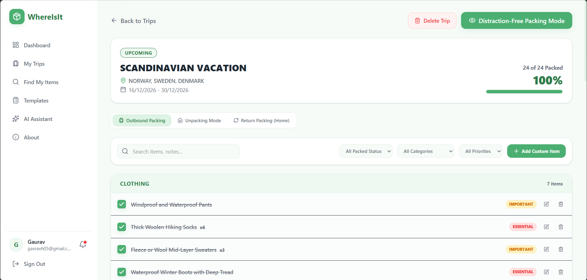
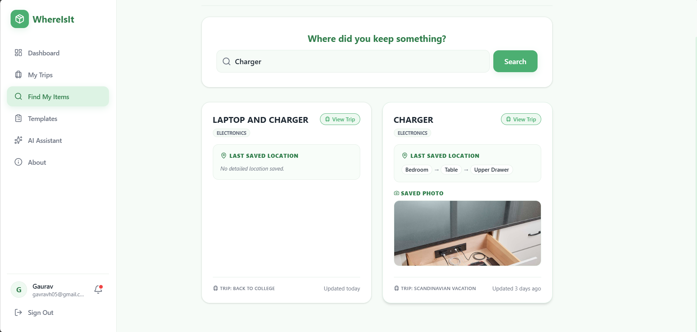
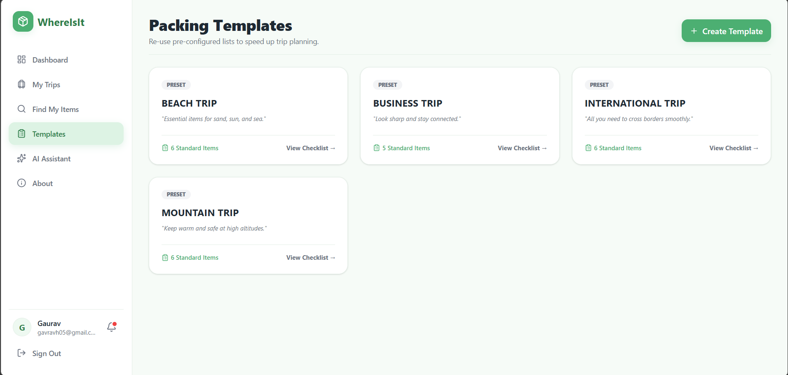
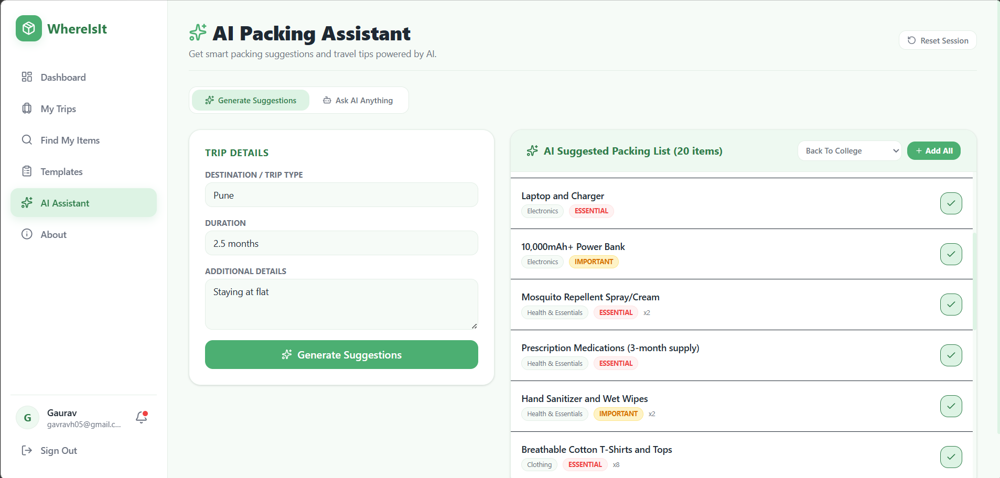
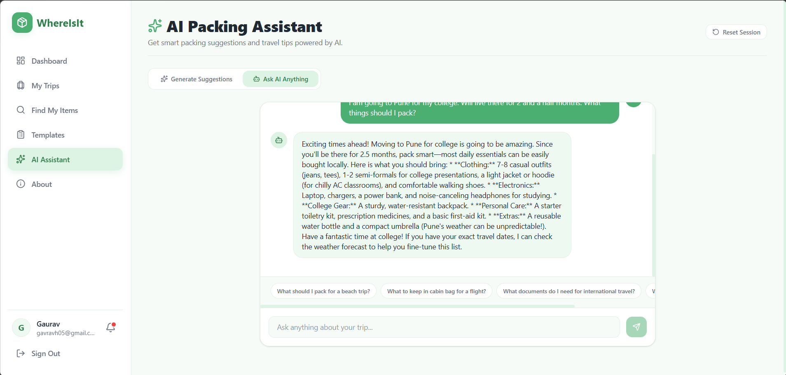

# WhereIsIt — Smart Travel Packing Assistant

> **Remember what to pack. Remember where you kept it.**

WhereIsIt is a full-stack smart travel packing application designed to solve a simple but common problem: forgetting what to pack and forgetting where you kept your belongings.

The application allows users to create trips, maintain packing lists, remember item locations, track packing progress, search for stored items, and receive AI-powered packing recommendations based on their trip.

---

## Screenshots

### Dashboard



### My Trips



### Find My Items



### Packing Templates



### AI Assistant





---

## Key Features

### Item Location Memory

The core feature of WhereIsIt is the ability to remember exactly where an item was kept.

For example:

```text
Passport
→ Bedroom
→ Study Table
→ Bottom Drawer
→ Under the blue notebook

WhereIsIt started with a simple problem I faced while packing for a trip, but building it turned that small idea into a complete full-stack application.

The goal is simple:

> **Pack with confidence. Find what you need. Forget nothing.**

Thanks for checking out WhereIsIt!
